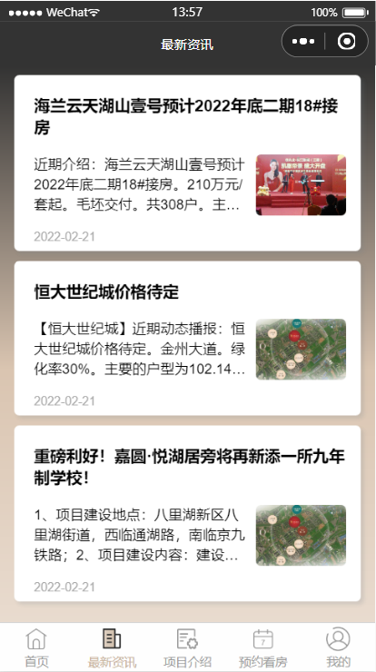
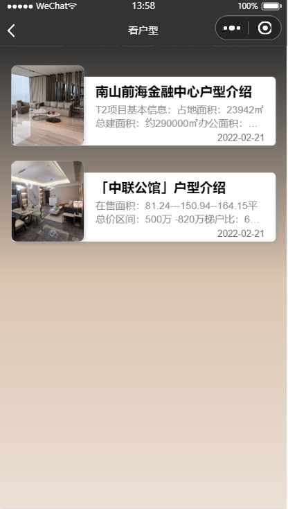
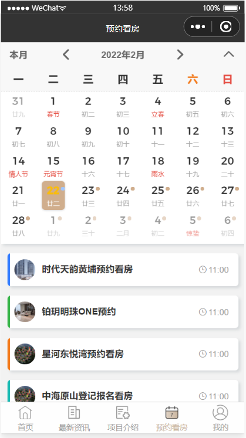
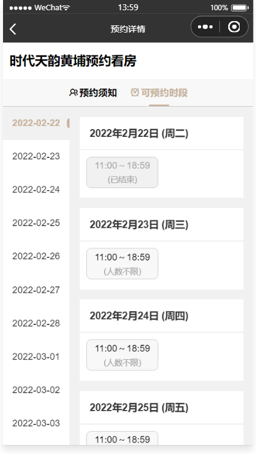
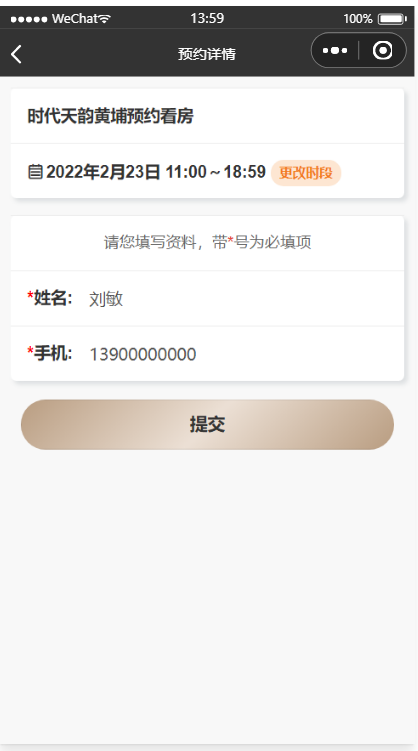
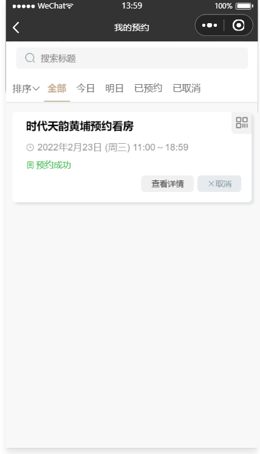
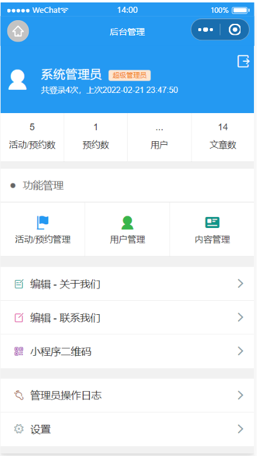
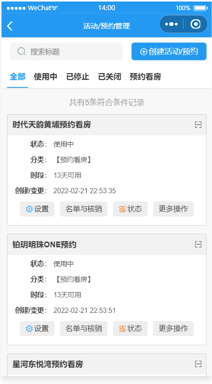
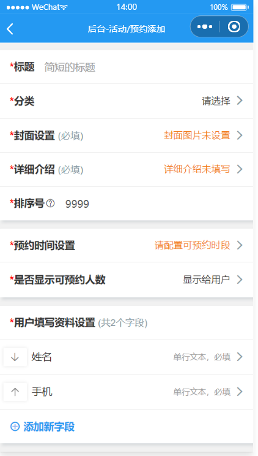
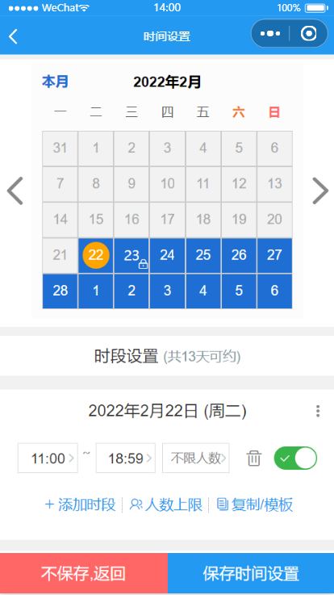

## 功能介绍 
    
 地产开盘小程序, 功能包括预约看房，楼盘项目介绍，楼盘户型，置业顾问介绍，微楼书，楼盘最新活动等，采用腾讯提供的小程序云开发解决方案，无须服务器和域名
 

## 技术运用
- 本项目使用微信小程序平台进行开发。
- 使用腾讯专门的小程序云开发技术，云资源包含云函数，数据库，带宽，存储空间，定时器等，资源配额价格低廉，无需域名和服务器即可搭建。
- 小程序本身的即用即走，适合小工具的使用场景，也适合快速开发迭代。
- 云开发技术采用腾讯内部链路，没有被黑客攻击的风险，安全性高且免维护。
- 资源承载力可根据业务发展需要随时弹性扩展。  

## 截图

 

## 作者
- 如有疑问，欢迎骚扰联系我鸭：开发交流，技术分享，问题答疑，功能建议收集，版本更新通知
- 俺的微信:
 

## 演示

## 安装

- 安装手册见源码包里的word文档